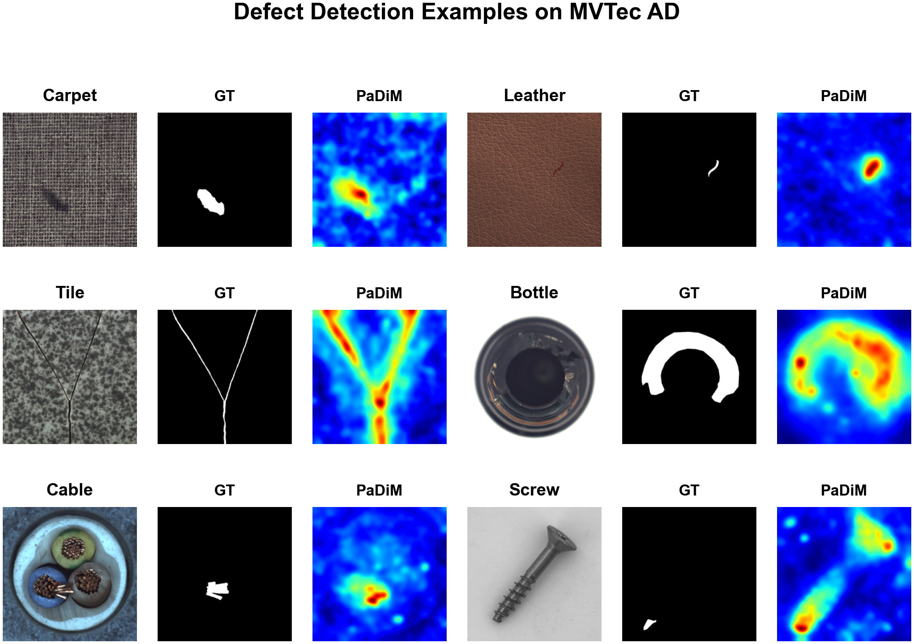
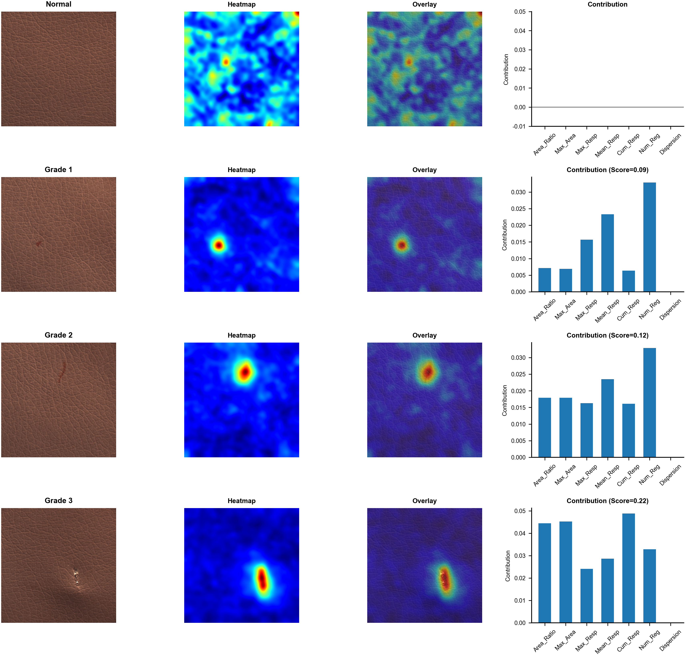

# Unsupervised Defect Severity Grading

This repository contains the core implementation of the paper:  
**"Severity grading of industrial defects without any labels: an interpretable unsupervised approach"**

---

## 📌 Project Overview
This work proposes an interpretable unsupervised framework for industrial defect severity grading, eliminating the need for labeled defect data. The method combines anomaly detection with interpretable feature analysis to automatically rank defects by severity.

---

## 📊 Results & Visualization

### Figure 1: Defect Detection & Severity Grading Examples
<p align="center">
  
  <br>
  <em>Figure 1: Examples of defect detection and automatic severity grading on industrial leather samples</em>
</p>

### Typical Defect Severity Cases
<p align="center">
  
  <br>
  <em>Figure 2: Representative cases of different defect severity levels (from mild to severe)</em>
</p>

---

## 🛠️ Environment & Dependencies
All required dependencies are listed in `requirements.txt`.  
To install the environment:
```bash
pip install -r requirements.txt
